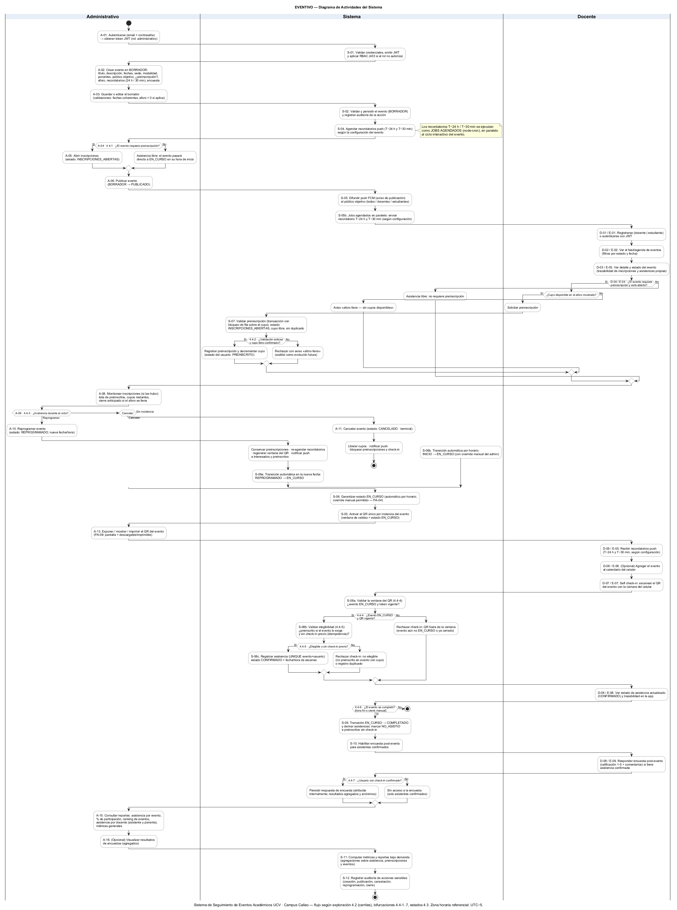
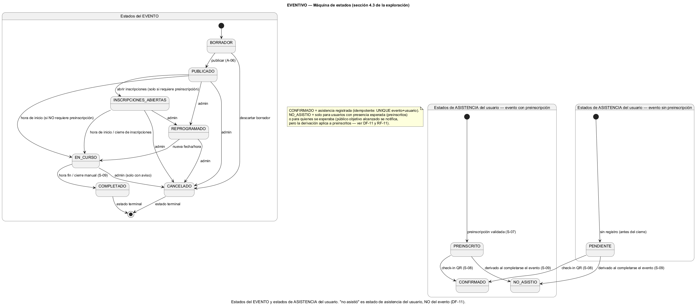

# 04 · Diagrama de Actividades del Sistema — **ENTREGABLE CENTRAL**

**EVENTIVO — Sistema de Seguimiento de Eventos Académicos UCV · Campus Callao**

> Esta es la **pieza central del entregable** para la revisión del Ingeniero (EC-02/EC-07). Describe el flujo completo del sistema en **4 carriles** (Administrativo · Sistema · Docente · Estudiante), organizado en **6 fases (F1–F6)** con **7 puntos de decisión (4.4-1..4.4-7)** y la **máquina de estados** del evento y de asistencia.

---

## 1. Diagrama renderizado



*Renderizado PlantUML (2 643 × 3 553 px). Fuente: [diagramas/eventivo-diagrama-actividades.puml](diagramas/eventivo-diagrama-actividades.puml) · [diagramas/eventivo-diagrama-actividades.mmd](diagramas/eventivo-diagrama-actividades.mmd). Zona horaria referencial: UTC−5.*

## 2. Máquina de estados (renderizada)



*Renderizado PlantUML (2 473 × 1 087 px). Fuente: [diagramas/eventivo-maquina-estados.puml](diagramas/eventivo-maquina-estados.puml).*

**Estados del EVENTO**: `borrador → publicado → inscripciones abiertas → en curso → completado | cancelado | reprogramado` (los estados terminales son `COMPLETADO` y `CANCELADO`).

**Estados de ASISTENCIA del usuario** (DF-11):
- Con preinscripción: `PREINSCRITO → CONFIRMADO (check-in) | NO_ASISTIO (derivado al completar)`.
- Sin preinscripción: `PENDIENTE → CONFIRMADO | NO_ASISTIO`.

> Recordatorio de modelado (DF-11): **"no asistió" NO es un estado del evento**; es un estado de **asistencia del usuario** derivado automáticamente cuando el evento `COMPLETADO` cierra sin el check-in del usuario.

---

## 3. Carriles y actores (swimlanes)

| Carril | Responsabilidades |
|---|---|
| **Administrativo** | Autenticarse, crear/editar borradores, publicar, abrir/monitorear inscripciones, reprogramar, cancelar, override manual de estados, mostrar/imprimir el QR, consultar reportes y encuestas. |
| **Sistema** | Validar y persistir, emitir JWT/RBAC, ejecutar la máquina de estados y los jobs horarios (transiciones + recordatorios), generar el QR, validar preinscripciones y check-ins, derivar `NO_ASISTIO`, habilitar encuestas, computar reportes y registrar auditoría. |
| **Docente** | Registrarse/autenticarse, ver feed y detalle, preinscribirse (si aplica), recibir recordatorios, agregar al calendario, self check-in, ver trazabilidad, responder encuesta; (si es ponente) consultar el reporte de su propio evento. |
| **Estudiante** | Mismo ciclo que el docente (feed, detalle, preinscripción, recordatorios, check-in, historial, encuesta). **Sin acceso a reportes.** |

## 4. Fases del flujo (F1–F6)

### Fase 1 · Creación y publicación
1. **A-01** El administrativo se autentica (email + contraseña → JWT con rol `administrativo`).
2. **S-01** El sistema valida credenciales, emite el JWT y aplica RBAC (403 si el rol no autoriza).
3. **A-02 / A-03** Crea el evento en **BORRADOR** (título, descripción, fechas, sede, modalidad, ponentes, público objetivo, preinscripción/aforo, recordatorios, encuesta) y lo guarda/edita con validaciones.
4. **S-02** El sistema valida y persiste el evento, registrando auditoría.
5. **S-04** Se agendan los recordatorios push **T−24 h / T−30 min** (jobs en paralelo, según configuración).
6. **Decisión 4.4-1** ¿El evento requiere preinscripción?
   - **Sí** → **A-05** abrir inscripciones (`INSCRIPCIONES_ABIERTAS`).
   - **No** → asistencia libre (pasará directo a `EN_CURSO` en su hora de inicio).
7. **A-06** Publicar (`BORRADOR → PUBLICADO`) y **S-05** difundir push FCM al público objetivo (todos/docentes/estudiantes) + centro in-app.

### Fase 2 · Preinscripción (docente / estudiante)
1. **D/E-01** Registro o autenticación con JWT.
2. **D/E-02 / D/E-03** Ver el feed/agenda (filtros por estado y fecha) y el detalle con el estado del usuario.
3. **Decisión D/E-04** ¿Requiere preinscripción y está abierto?
   - **Sí** → **¿Cupo disponible?** → solicitar preinscripción.
   - **S-07** Validación con **transacción + bloqueo de fila sobre el cupo** (estado, cupo libre, sin duplicado).
   - **Decisión 4.4-2** ¿Validación exitosa y cupo confirmado?
     - **Sí** → registrar preinscripción y decrementar el cupo (usuario `PREINSCRITO`).
     - **No** → aviso "aforo lleno" (waitlist como evolución futura).
4. **A-08** El admin monitorea preinscritos/cupos y puede cerrar anticipadamente.

### Fase 3 · Incidencia (reprogramar / cancelar) — Decisión 4.4-3
| Rama | Acción | Efectos del sistema |
|---|---|---|
| **Reprogramar** | **A-10** → `REPROGRAMADO` (nueva fecha/hora) | Conservar preinscripciones · re-agendar recordatorios · regenerar ventana del QR · notificar push a interesados y preinscritos → luego transición automática `REPROGRAMADO → EN_CURSO`. |
| **Cancelar** | **A-11** → `CANCELADO` (**terminal**) | Liberar cupos · notificar push · bloquear preinscripciones y check-in → **FIN**. |
| **Sin incidencia** | — | Continúa a la transición automática por horario (`INICIO → EN_CURSO`, con override manual del admin, PA-04). |

### Fase 4 · Ejecución (self check-in)
1. **S-06** Garantizar `EN_CURSO` (automático por horario / override manual).
2. **S-03** Activar el **QR único por instancia** (ventana de validez = estado `EN_CURSO`).
3. **A-13** El admin expone/muestra/imprime el QR (PA-09).
4. **D/E-05** El usuario recibe recordatorios push (T−24 h / T−30 min, según configuración).
5. **D/E-06** (Opcional) Agregar el evento al calendario del celular.
6. **D/E-07** **Self check-in**: escanear el QR con la cámara del celular.
7. **S-08a · Decisión 4.4-4** ¿Evento `EN_CURSO` y QR vigente?
   - **No** → rechazar: "QR fuera de la ventana".
   - **Sí** → **S-08b · Decisión 4.4-5** ¿Elegible (preinscrito si aplica) y sin check-in previo?
     - **No** → rechazar: no elegible o registro duplicado.
     - **Sí** → **S-08c** registrar asistencia (UNIQUE evento+usuario) → `CONFIRMADO` + fecha/hora.
8. **D/E-08** Ver estado de asistencia actualizado y trazabilidad.

### Fase 5 · Cierre y encuesta
1. **Decisión 4.4-6** ¿El evento se completó? (hora fin o cierre manual)
   - **No** → continúa en curso (transición automática pendiente).
   - **Sí** → **S-09** `EN_CURSO → COMPLETADO` y se deriva `NO_ASISTIO` a los preinscritos sin check-in.
2. **S-10** Habilitar la encuesta post-evento para asistentes confirmados.
3. **D/E-09** Responder encuesta (calificación 1–5 + comentarios) si tiene asistencia confirmada.
4. **Decisión 4.4-7** ¿Usuario con check-in confirmado?
   - **Sí** → persistir respuesta (atribuida internamente; resultados **agregados y anónimos**).
   - **No** → sin acceso a la encuesta ("solo asistentes confirmados").

### Fase 6 · Reportes y auditoría
1. **A-15** Consultar reportes: asistencia por evento, % de participación, ranking de eventos, asistencia por docente (asistente y ponente), métricas generales.
2. **A-16** (Opcional) Visualizar resultados de encuestas (agregados).
3. **S-11** Computar métricas y reportes bajo demanda (agregaciones sobre registros persistidos).
4. **S-12** Registrar auditoría de acciones sensibles (creación, publicación, cancelación, reprogramación, cierre).

---

## 5. Los 7 puntos de decisión (bifurcaciones)

| # | Decisión (¿…?) | Ramas | Referencia |
|---|---|---|---|
| **4.4-1** | ¿El evento requiere preinscripción? | Sí → abrir inscripciones · No → asistencia libre/EN_CURSO directo | RF-08/BR-02 |
| **4.4-2** | ¿Cupo libre confirmado (validación transaccional)? | Sí → PREINSCRITO + decrementar cupo · No → "aforo lleno" | RF-08/EC-03 |
| **4.4-3** | ¿Incidencia durante el ciclo? | Reprogramar · Cancelar · Sin incidencia | RF-17/RF-18 |
| **4.4-4** | ¿Evento `EN_CURSO` y QR vigente? | Sí → validar elegibilidad · No → "check-in no disponible" | RF-10/DF-12 |
| **4.4-5** | ¿Usuario elegible y sin check-in previo? | Sí → CONFIRMADO · No → rechazo (no elegible/duplicado) | RF-11/DF-13/DF-14 |
| **4.4-6** | ¿El evento se completó? | Sí → COMPLETADO + derivar NO_ASISTIO + encuesta · No → continúa | RF-05/DF-11 |
| **4.4-7** | ¿Usuario con asistencia confirmada? | Sí → responder encuesta · No → sin acceso | RF-13/BR-04 |

## 6. Diagrama ASCII legible (vista de carriles)

```
           ADMINISTRATIVO                     SISTEMA                        DOCENTE / ESTUDIANTE
FASE 1    [A-01 Autenticarse (JWT)] ──► [S-01 Validar credenciales + RBAC]
          [A-02 Crear evento BORRADOR] ──► [S-02 Persistir + auditoría]
          [A-03 Guardar/editar borrador] ──► [S-04 Agendar recordatorios T−24h/T−30m (jobs paralelos)]
          ¿(4.4-1) Requiere preinscripción? ──Sí──► [A-05 Abrir inscripciones]
                         └─No─► (asistencia libre → EN_CURSO directo)
          [A-06 Publicar] ──► [S-05 Push FCM difusión al público objetivo]
FASE 2                                                          [D/E-01 Registro o login JWT]
                                                                [D/E-02 Ver feed/agenda]
                                                                [D/E-03 Ver detalle + mi estado]
                                                                ¿Requiere preinscripción y abierta?
                                                                     │Sí
                                                                     ▼
                                                                [Solicitar preinscripción]
                                                                ──► [S-07 Validar (transacción con bloqueo de fila)]
                                                                     ¿(4.4-2) Cupo libre confirmado?
                                                                        │Sí ──► PREINSCRITO (+decrementar cupo)
                                                                        └No ─► Aviso «aforo lleno»
          [A-08 Monitorear inscripciones (preinscritos, cupos)]
FASE 3    ¿(4.4-3) Incidencia?
          ├─Reprogramar─► [A-10 REPROGRAMADO] ──► [S: conservar preinsc., re-agendar, re-QR, notificar]
          ├─Cancelar───► [A-11 CANCELADO] ──► [S: liberar cupos, notificar, bloquear] ▬► FIN
          └─Sin incidencia
                                                 [S-06 → EN_CURSO (automático por horario / override admin)]
FASE 4    [S-03 Activar QR (ventana = EN_CURSO)]   [A-13 Mostrar/imprimir QR]
                                                                [D/E-05 Recibir recordatorios push]
                                                                [D/E-06 (opcional) Agregar al calendario]
                                                                [D/E-07 Self check-in: escanear QR]
                                                                ──► [S-08a ¿(4.4-4) EN_CURSO y QR vigente?]
                                                                     │Sí
                                                                     ▼
                                                                [S-08b ¿(4.4-5) Elegible y sin check-in previo?]
                                                                     │Sí ──► [S-08c Registrar CONFIRMADO (idempotente)]
                                                                     └No ─► Rechazo (no elegible/duplicado)
                                                                [D/E-08 Ver estado CONFIRMADO en la app]
FASE 5    ¿(4.4-6) Evento completado? ──Sí──► [S-09 COMPLETADO + derivar NO_ASISTIO a preinscritos]
                                        [S-10 Habilitar encuesta]
                                                                [D/E-09 Responder encuesta (calificación + comentarios)]
                                                                ¿(4.4-7) Asistió confirmado?
                                                                   │Sí ──► Persistir (resultados agregados/anónimos)
                                                                   └No ─► Sin acceso a encuesta
FASE 6    [A-15 Consultar reportes] ◄── [S-11 Computar métricas]
          [A-16 Ver encuestas (agregados)] ──► [S-12 Auditoría] ▬► FIN
```

## 7. Nodos de acción (EA) por carril

| Carril | Nodos |
|---|---|
| Administrativo | A-01..A-16 (autenticación → creación → publicación → monitoreo → incidencias → QR → reportes) |
| Sistema | S-01..S-12 (validación, persistencia, jobs, difusión, preinscripción, check-in, derivación, encuesta, reportes, auditoría) |
| Docente | D-01..D-09 (y D-10: ponente consulta su reporte) |
| Estudiante | E-01..E-09 (E-10: sin reportes) |

**Criterio EC-02**: cada nodo de acción (EA-01..EA-3x) y cada bifurcación (4.4-1..7) debe tener al menos un caso de uso implementado y verificable en la demo.

---

## 8. Archivos fuente

| Archivo | Tipo |
|---|---|
| [diagramas/eventivo-diagrama-actividades.png](diagramas/eventivo-diagrama-actividades.png) | Diagrama de actividades renderizado |
| [diagramas/eventivo-maquina-estados.png](diagramas/eventivo-maquina-estados.png) | Máquina de estados renderizada |
| [diagramas/eventivo-diagrama-actividades.puml](diagramas/eventivo-diagrama-actividades.puml) | Fuente PlantUML (actividades) |
| [diagramas/eventivo-diagrama-actividades.mmd](diagramas/eventivo-diagrama-actividades.mmd) | Fuente Mermaid (actividades) |
| [diagramas/eventivo-maquina-estados.puml](diagramas/eventivo-maquina-estados.puml) | Fuente PlantUML (máquina de estados) |

*Siguiente documento: [05-arquitectura.md](05-arquitectura.md)*